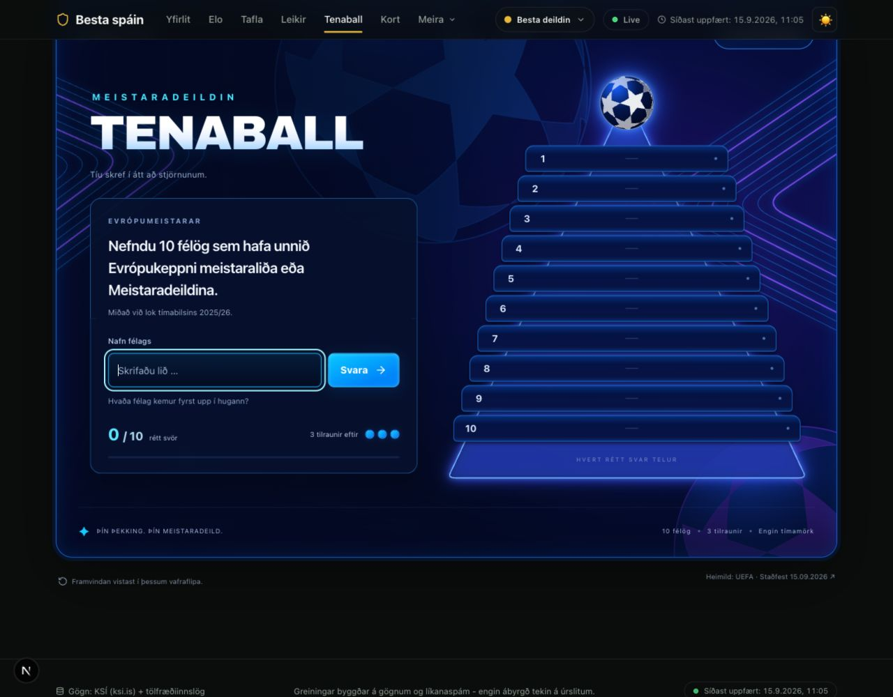
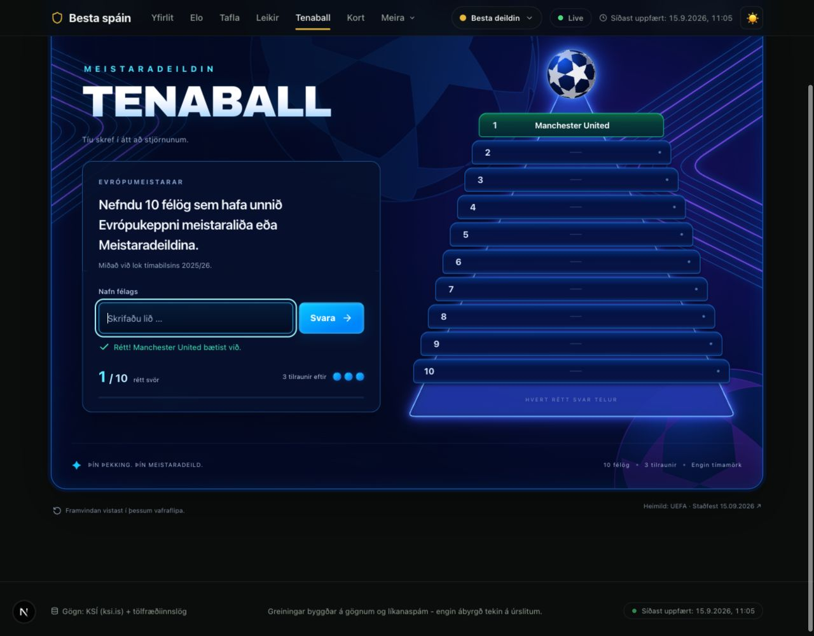
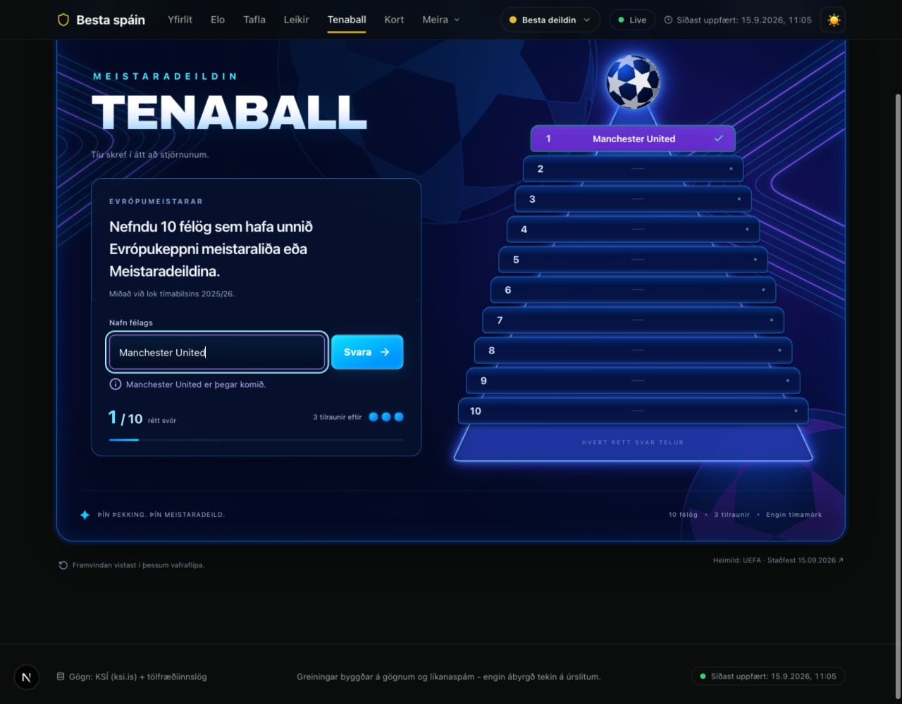
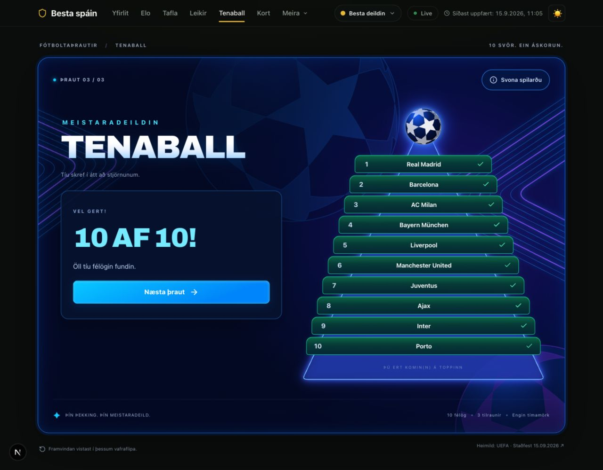
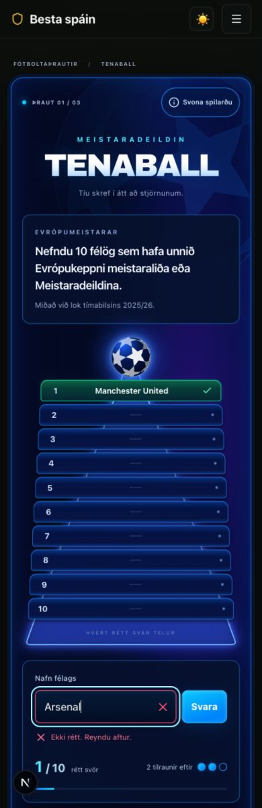
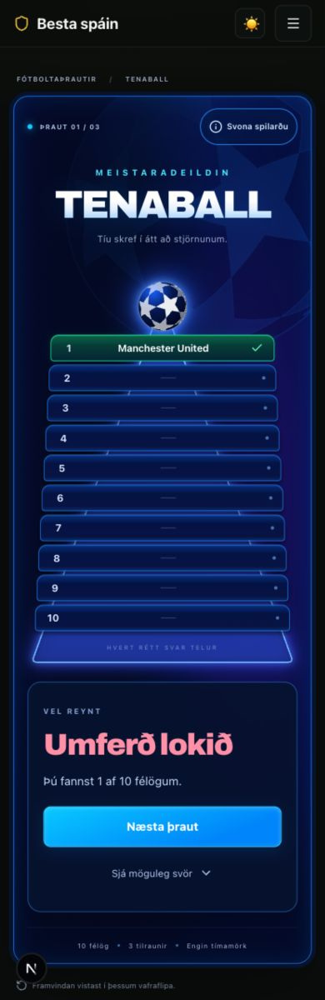
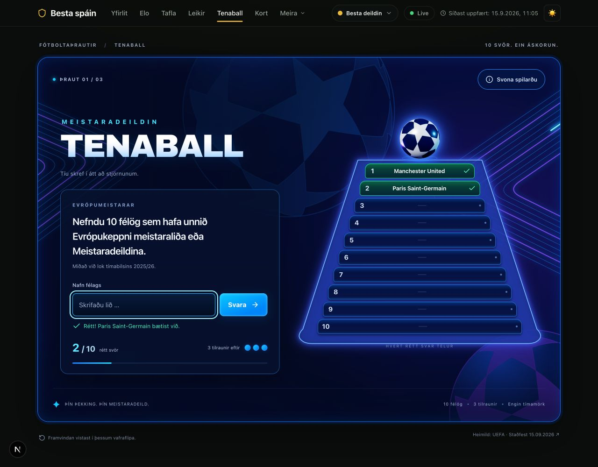

# Tenaball — útfærsla og prófanir

Top 10 síðan á `/topp10` er nú Meistaradeildin Tenaball. Byggt með núverandi Next.js/React, HTML, CSS og SVG. Engin ný keyrslusöfn voru sett inn. Stjörnuboltinn og línur endurnýta rúmfræði Meistaradeildarþemans; viðmiðunarmyndin er ekki notuð sem viðmót.

## Leikur

- Tíu ólík félög í innsláttarröð; þrjár rangar tilraunir.
- Allir 24 sigurvegarar til loka 2025/26 gilda í fyrstu þrautinni, þar á meðal Chelsea.
- Tvær aðrar þrautir: sigurvegarar frá 1992/93 og félög sem unnu í báðum tímabilum.
- Stöðug félagaauðkenni og nákvæm heitisafbrigði. Tvíræð heiti eru ekki sjálfkrafa samþykkt.
- Sigur/tap, möguleg svör, næsta þraut og vistun í sessionStorage.
- Rétt, rangt og endurtekið svar hafa aðskilin sjónræn viðbrögð. Hreyfingar stýra aldrei leikreglunum.
- 16 sekúndna bakgrunnur, einnota siguráhrif og stuðningur við prefers-reduced-motion.

Heimild og viðmiðunardagur eru skráð í `web/src/lib/tenaball/data.ts`: [UEFA honours board](https://www.uefa.com/news/0275-1541637ad1db-88aeeefefefd-1000--all-time-honours-board/), staðfest 15.09.2026.

## Staðfesting

- Sjálfvirk próf: gild heiti, kommur/bil, samheiti sama félags, tvíræð heiti, tómt/rangt svar, þrjár villur, tíunda svar, lokunarvörn, tvítekin sending, endurheimt og skemmd vistun, ólík skilyrði þrautanna.
- Hreyfipróf: minni hreyfing stöðvar teikningu, falinn flipi og ósýnilegt svæði stöðva lykkju, áframhald hoppar ekki um falinn tíma, tvær heilar 16 sekúndna lykkjur skila sömu línulögun og hreinsun fjarlægir lykkju/hlustara.
- Keyrandi vafri: rétt/rangt/endurtekið svar, Enter og tvísmellur, heilar sigur- og tapumferðir, næsta þraut, möguleg svör, endurhleðsla í miðri umferð og eftir sigur. Engin sigurhreyfing eftir endurhleðslu.
- Skjábreiddir 1280, 390 og 320 px. Langt félagaheiti passar í efsta þrep á 320 px; engin lárétt yfirflæði.
- Sýnilegur fókus á svarreit, fókus á niðurstöðu við lok og lifandi tilkynningasvæði.
- TypeScript og framleiðslubygging standast. Sjálfstæð kóðayfirferð fann engin atriði til lagfæringar.

## Takmarkanir

Símaprófun var gerð með skjástærðarhermun í vafra; raunverulegt símatæki og skjályklaborð voru ekki prófuð. Minni hreyfing og tvær fullar lykkjur voru staðfest með sjálfvirkum lífsferilsprófum; stýrikerfisstilling minni hreyfingar var ekki breytt í sjónrænni vafraprófun. Engin hljóð eru spiluð. Niðurstöður nýrri tímabila þurfa gagnauppfærslu. Breytingarnar eru staðbundnar og hafa ekki verið birtar á framleiðsluvef.

## Skjáskot

### Upphaf

### Rétt svar

### Endurtekið svar

### Rangt svar

### Sigur

### Sími

### Tap á síma

## 3D-bolti efst á pýramída

Boltinn er nú WebGL-kúla með stjörnumynstri sem er vafið um yfirborðið. Hann snýst einn hring á 12 sekúndum, svífur örlítið og hefur hvíta, ljósbláa og fjólubláa lýsingu. Three.js var þegar uppsett; það er hlaðið þegar boltinn birtist. Kyrr SVG-bolti er varaleið ef WebGL er ekki tiltækt.

353 prófanir og framleiðslubygging standast. Ný próf staðfesta heilan snúning, minni hreyfingu, hlé þegar flipi/svæði er falið og hreinsun. Í vafra var staðfest að WebGL væri virkt, að boltinn stöðvaðist utan skjás og héldi áfram þegar hann birtist aftur, og að svar gæfi stig í símaútliti með 3D-boltann virkan.

